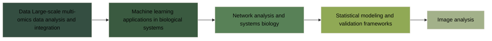

*"The future belongs to those who learn more skills and combine them in creative ways." - Robert Greene*

# Hi there 👋 I'm Mirza Shoaib

[](https://scholar.google.com/citations?user=5-XS82MAAAAJ)
[](https://www.researchgate.net/profile/Mirza-Shoaib)
[](https://www.linkedin.com/in/mirzashoaib/)

A computational biologist specializing in machine learning applications and large-scale biological data analysis. Currently completing my PhD at La Trobe University in collaboration with Agriculture Victoria Research, I develop innovative computational methods to analyze complex biological datasets and extract meaningful insights from multi-omics data.

With over a decade of experience spanning research and industry, I've successfully developed seven patented varieties and led multidisciplinary teams. My work has earned international recognition, including a product selected as Japan's Flower of the Year 2017, demonstrating my ability to translate complex research into practical solutions.

## 🧬 Research Focus

- **Large-scale multi-omics data analysis and integration**
- **Machine learning applications in biological systems**
- **Network analysis and systems biology**
- **Statistical modeling and validation frameworks**
- **Image analysis**

  
## 🛠️ Technical Stack
```python
tech_stack = {
    'languages': ['Python', 'R', 'LaTeX'],
    'ml_tools': ['scikit-learn', 'TensorFlow', 'PyTorch', 'keras'],
    'data_analysis': ['pandas', 'numpy', 'tidyverse', 'dplyr'],
    'visualization': ['matplotlib', 'seaborn', 'ggplot2', 'plotly'],
    'bioinformatics': ['custom pipelines', 'metabolomics analysis', 'image processing'],
    'dev_tools': ['git', 'jupyter', 'RStudio']
}
```

## 🚀 Featured Projects

<div align="center">
<table>
<tr>
<td width="50%">
<h3 align="center">ART (Algorithmic Root Traits)</h3>
<div align="center">
  <a href="https://github.com/shoaibms/ART" target="_blank">
    
  </a>
  <p>
    <a href="https://github.com/shoaibms/ART" target="_blank">
      
    </a>
  </p>
  <p><strong>Python, scikit-learn, OpenCV</strong> - Novel computational method for extracting latent traits from plant root images</p>
</div>
</td>
<td width="50%">
<h3 align="center">Metabolomic Network Analysis</h3>
<div align="center">
  <a href="https://github.com/shoaibms/metabolomics" target="_blank">
    
  </a>
  <p>
    <a href="https://github.com/shoaibms/metabolomics" target="_blank">
      
  </p>
  <p><strong>R, Python, networkx</strong> - Advanced network analysis for molecular response investigation</p>
</div>
</td>
</tr>
</table>
</div>

## 📚 Publications & Impact
<table>
<tr>
<td width="60%">
  
**Recent Publications**
- [AutoML: Advanced Tool for Mining Multivariate Plant Traits](https://doi.org/10.1016/j.tplants.2023.09.008) (2023) *Trends in Plant Science*
- [Roots Drought Adaptive Traits in Crop Improvement](https://www.mdpi.com/2223-7747/11/17/2256) (2022) *Plants*
</td>
<td width="40%">

**Metrics, Awards & Patents**
- 📈 High-impact publications (IF: 22.5)
- 🔑 7 Plant variety patents
- 🏆 Multiple international awards for plant varities and photography
</td>
</tr>
</table>

## 🔬 Current Work


## 📈 Stats & Activity
<div align="center">
  
  
</div>

<div align="center">
  
</div>

## 📫 Connect
```python
contact_info = {
    'email': 'shoaibmirza2200@gmail.com',
    'linkedin': 'mirzashoaib',
    'google_scholar': '5-XS82MAAAAJ'
}
```

---
<div align="right">
<sub><sup>🌱 Always growing, always learning</sup></sub>
</div>

